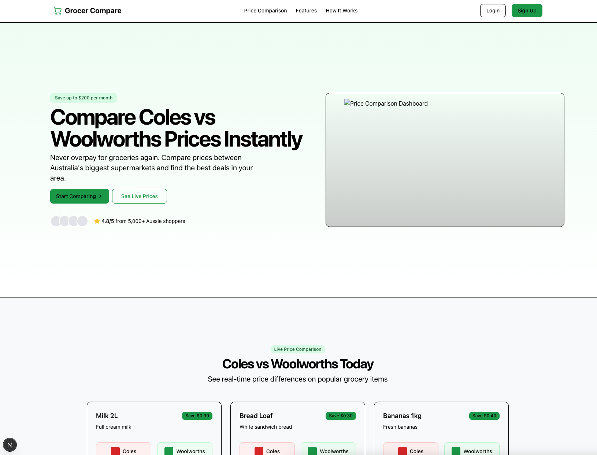

## Price Compare App

A modern full-stack price comparison app that helps users easily compare grocery prices across stores.  

Built with transparency and usability in mind, powered by Next.js, Java Spring boot, and PostgreSQL.

---

## Project Overview

**Price Compare App** is designed to help everyday shoppers make smarter decisions by comparing prices across multiple vendors.

- 🧾 Compare grocery items across Coles, Woolworths, and more
- 🔍 Filter by category, price, and store
- ⚡ Fast and responsive frontend built with **Next.js** and **Tailwind CSS**
- 📦 Scalable backend with **Java Spring boot**, **Express**, and **PostgreSQL**

> ⚠️ This repo is **partially open-source** and intended for educational or portfolio reference only.  
> Core business logic (e.g., scraping, price normalization, backend architecture) is **not included** for IP protection.

---

## Tech Stack

| Layer        | Tech                              |
|-------------|------------------------------------|
| Frontend     | Next.js, Tailwind CSS, React       |
| Backend API  | Java Spring boot, Express          |
| Database     | PostgreSQL                         |
| Deployment   | Vercel / Docker (future)  |

---

## Screenshots



---

## 🚀 Getting Started

```bash
# Install dependencies
npm install

# Run development server
npm run dev
```

---

## License

This project is licensed under the [Creative Commons Attribution-NonCommercial 4.0 International (CC BY-NC 4.0) license](https://creativecommons.org/licenses/by-nc/4.0/deed.en).
You may use the code for learning, personal study, or inspiration, but commercial use is strictly prohibited.

---

## Contact

For business inquiries, licensing, or commercial use, please get in touch.

If you are interested in collaboration, freelance opportunities, or commercial partnerships, feel free to contact:

📧 [it@luminaweb.dev](mailto:it@luminaweb.dev)

🌐 [Lumina Dev](https://www.luminaweb.dev)

🧑‍💻 [Lumina Dev](https://www.linkedin.com/company/lumina-dev)

